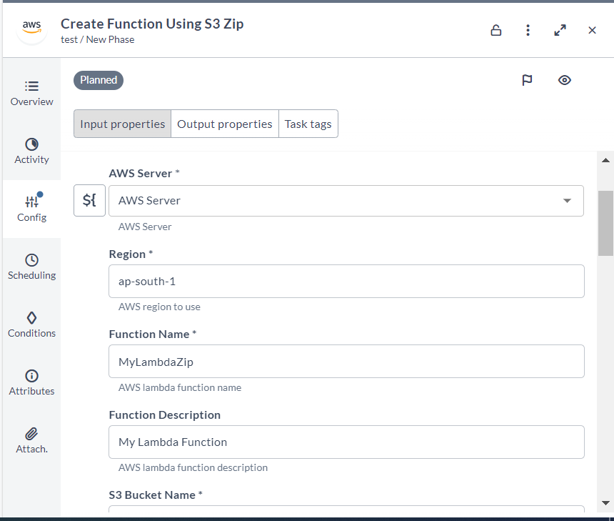
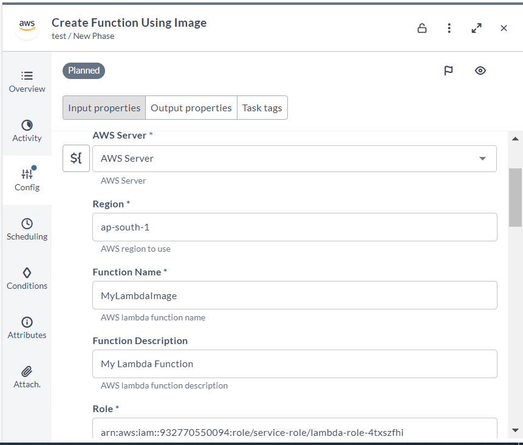
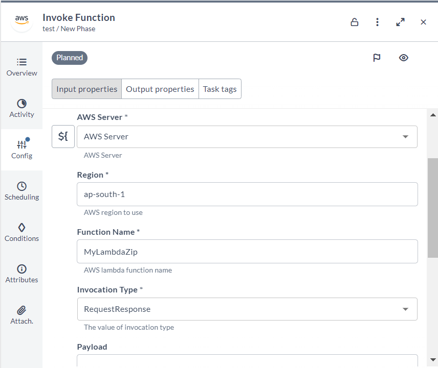

# Manage your AWS lambda function

### Before you begin
This how-to involves working with a variety of tools, such as Digital.ai Release and AWS. You can perform this task by following the instructions. However, being familiar with these tools and technologies can significantly help you when you try them out in your test environment.

### What's the objective?
The objective is to create, update, invoke, and delete AWS Lambda functions using packages such as .zip files or container images using Digital.ai Release.

### What do you need?
* A Linux or Windows server (with root and Internet access) that has Digital.ai Release version 23.3.0 (or later) installed
* Remote runner setup for Digital.ai Release
* AWS integration for Digital.ai Release

### What do you have?
* AWS environment access and credentials

### How does it work?
The AWS integration is based on your inputs, such as function name, S3 zip file, and runtime It allows the creation, updating, invocation, and deletion of AWS Lambda functions using packages like .zip files or container images.

### Set up the AWS server

The connection accepts the following inputs:

1. **Title:** The name for the configuration.
2. **Access Key ID:** The value of AWS Access Key ID
3. **Secret Access Key:** The value of AWS Secret Access Key
4. **Session Token:** The value of AWS Session Token

### AWS: Create Function Using S3 Zip (Container)

This task creates an AWS Lambda Function using an S3 zip file.

It accepts the following inputs:

1. **Host:**  Select the AWS server connection.
2. **Region:** AWS region to use
3. **Function Name:** AWS lambda function name
4. **function Description:** AWS lambda function description
5. **S3 Bucket Name:** AWS S3 bucket name where the .zip file containing your deployment package is stored
6. **S3 Object Key:** path to your lambda-package.zip
7. **S3 Object Version:** The AWS S3 object (the deployment package) version
8. **Runtime:** The runtime environment for the Lambda. ex: python3.8
9. **Role:** The Amazon Resource Name (ARN) of the IAM role
10. **Handler:** The function within your code that Lambda calls to begin execution
11. **Wait:** For Active State: Wait until the function becomes active state
12. **Wait Interval:** Wait interval in seconds between tries
13. **Timeout:** Wait timeout in seconds
14. **Subnet Ids:** A list of VPC subnet IDs. Use a comma for separation
15. **Security GroupIds:** A list of VPC security group IDs. Use a comma for separation
16. **Memory Size:** The amount of memory, in MB, the Lambda function is given
17. **Environment:** The key-value pairs that are accessible from function code during execution
18. **Publish:** Set to true to publish the first version of the function during creation
19. **Tags:** The list of tags (key-value pairs) assigned to the new function

### AWS: Create an AWS Lambda Function using Image (Container)

This task creates an AWS Lambda Function using AWS Image.

It accepts the following inputs:

1. **Host:**  Select the AWS server connection.
2. **Region:** AWS region to use
3. **Function Name:** AWS lambda function name
4. **function Description:** AWS lambda function description
5. **Role:** The Amazon Resource Name (ARN) of the IAM role
6. **Image Uri:** URI of a container image in the Amazon ECR registry
7. **Wait:** For Active State: Wait until the function becomes active state
8. **Wait Interval:** Wait interval in seconds between tries
9. **Timeout:** Wait timeout in seconds
10. **Subnet Ids:** A list of VPC subnet IDs. Use a comma for separation
11. **Security GroupIds:** A list of VPC security group IDs. Use a comma for separation
12. **Environment:** The key-value pairs that are accessible from function code during execution
13. **Publish:** Set to true to publish the first version of the function during creation
14. **Tags:** The list of tags (key-value pairs) assigned to the new function

### AWS: Invoke Function (Container)

This task invoke an AWS Lambda Function.

It accepts the following inputs:

1. **Host:**  Select the AWS server connection.
2. **Region:** AWS region to use
3. **Function Name:** AWS lambda function name
4. **Invocation Type:** Select the invocation type
5. **Payload:** The JSON that you want to provide to your Lambda function as input
6. **Client Context:** The value of client context
7. **Qualifier:** Specify a version or alias to invoke a published version of the function

